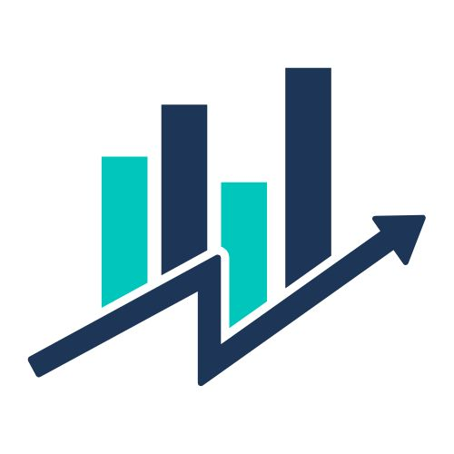

# Digital Marketing Agency

**GrowthHackers**

## Project Summary

The GrowthHackers Digital Marketing Agency website is a responsive web platform designed to showcase data-driven marketing services and drive client acquisition. It serves as the digital storefront for the agency, highlighting their expertise in SEO, social media, and PPC advertising through case studies, team profiles, and an interactive contact system with location-based mapping.

The platform effectively bridges the gap between potential clients and the agency's growth-focused marketing solutions.

## Design Choices

### Wireframe & Layout
**Landing Page**

**About Us Page**

**Contact Us Page**

The website follows a conversion-focused, clean aesthetic with balanced visual impact and data-driven content:

1. **Homepage Structure**:

   - **Hero Section**: Full-width header with value proposition + CTA button
   - **Services Grid**: 3-column cards (desktop) → 1-column stack (mobile)
   - **Case Studies**: Right-aligned cards (desktop) → top-aligned (mobile)

2. **Navigation**:

   - Sticky navbar with logo + simplified menu
   - Mobile hamburger menu with smooth dropdown

3. **Visual Hierarchy**:
   - (`#00c6bc`) for CTAs and interactive elements
   - Card-based design with consistent shadows/hover effects
   - Strategic white space between sections

### Logo

The logo features a stylized bar chart with four vertical bars of varying heights. The bars alternate in color between cyan and dark blue.

Running diagonally from the bottom left to the top right is a sharp, zigzagging arrow, also in dark blue. The arrow cuts through the bars, giving a sense of dynamic movement and growth, commonly associated with financial, business, or analytics themes.

The overall design conveys progress, upward trends, and data-driven success. It's clean, modern, and likely suited for a business in finance, technology, analytics, or consulting.

### Colors

- **Primary (White - #ffffff):** Used for backgrounds and text contrast.
- **Secondary (Dark Blue - #1d3557):** Represents sleekness and exudes professionalism.
- **Tertiary (Cyan - #00c6bc):** Used for buttons and hover accents to add a little brightness.

## Bootstrap SCSS Customizations

### Theme Customization

- Bootstrap's theme colors have been customized to align with the project's branding.
- (`#1d3557`) was used for the overall theme of the website.
- Several sections of the website used the given color in order to follow the project's branding.

### Custom Button

- A hover animation was added to the buttons.
- The button used the color of (`#00c6bc`) for better contrast with the theme color.
- Hover scaling also added to the buttons.

### Form Style

- Forms have been stylized with custom buttons.
- Added box-shadow effect on the forms.

## Live Demo

https://sherwinpaga.github.io/csgvMidTerm/
